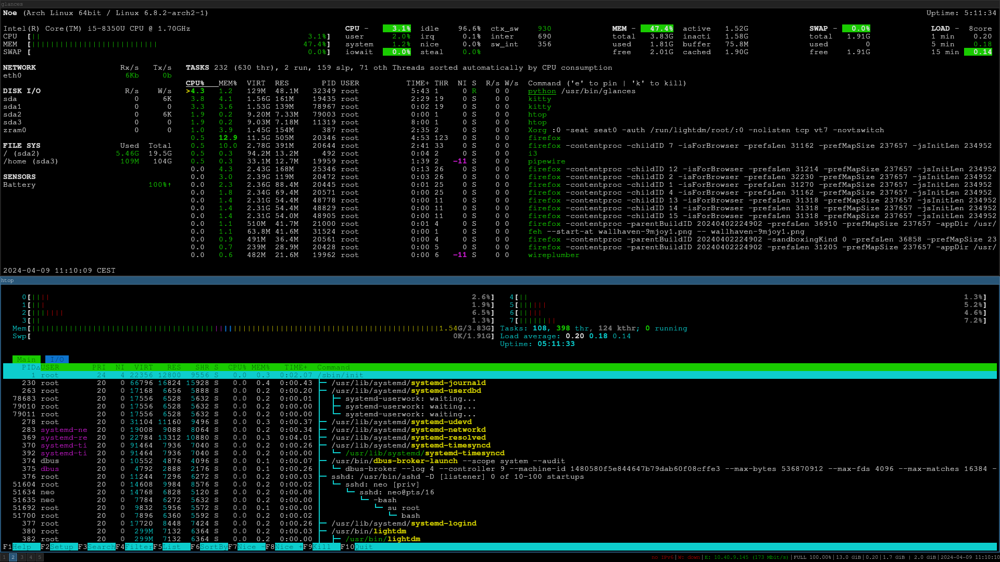

## Introduction

In the fascinating realm of Linux system administration, effective monitoring is the key to keeping things running smoothly. This document offers a comprehensive overview of monitoring tools and techniques, providing system administrators and SOC analysts with the know-how to monitor Linux systems like a boss.

Linux, the ultimate playground for system aficionados, boasts an arsenal of server monitoring commands that'll knock your socks off! From the classics like "top" and "sar" to the sleek and savvy "glance," "htop," and "Netdata," Linux serves up a buffet of options to keep your system singing like a canary!

## Tools Overview

### Glance - The Quick Glance Master

**What's Glance All About?**  
Glance is your go-to command-line buddy for a quick overview of system resources. It's like a lightning-fast tour guide, showing you CPU, memory, disk I/O, network usage, and process activity in a user-friendly interface.

**How to Get Glance?**  
Get Glance up and running with a snap of your fingers. No complicated setups, just pure monitoring magic!

**How to Use Glance?**  
Dive into the Glance universe with `glance` and explore the wonders of system health in no time!

### Vmstat - The Memory Maestro

**What's Vmstat Bringing to the Table?**  
Vmstat, the virtual memory stats guru, gives you the lowdown on processes, memory, disk I/O, traps, and CPU activity. It's like having a memory wizard at your command!

**How to Get Vmstat?**  
Grab Vmstat from the Linux toolbox and let it work its memory magic on your system.

**How to Master Vmstat?**  
Summon Vmstat with `vmstat` and unveil the secrets of system performance like a true wizard!

### Nload - The Network Navigator

**What's Nload's Mission?**  
Nload is your lightweight network traffic monitor, showing you real-time bandwidth usage with ease. It's like having a navigator guiding you through the network seas!

**How to Harness Nload's Power?**  
Install Nload and let it chart your network course with its intuitive interface.

**How to Navigate with Nload?**  
Set sail with `nload` and explore the vast seas of network traffic like a seasoned captain!

### Systemd-analyze - The Boot Time Guru

**What's Systemd-analyze's Superpower?**  
Systemd-analyze is your boot time wizard, offering insights into system initialization and service dependencies. It's like having a backstage pass to the system boot process!

**How to Unlock Systemd-analyze?**  
Summon Systemd-analyze and let it work its boot time magic on your system.

**How to Dive into Systemd-analyze?**  
Explore the boot process with `systemd-analyze` and optimize your system startup like a pro!

### Pstree - The Process Whisperer

**What's Pstree's Secret?**  
Pstree is your process whisperer, showing you process hierarchies in a tree-like format. It's like having a roadmap to process management!

**How to Summon Pstree?**  
Call forth Pstree and let it unravel the mysteries of process relationships.

**How to Communicate with Pstree?**  
Explore process hierarchies with `pstree` and troubleshoot like a detective!

### Free - The Memory Maverick

**What's Free Bringing to the Party?**  
Free is your memory maverick, offering insights into system memory usage. It's like having a memory guru by your side!

**How to Embrace Free?**  
Install Free and let it work its memory magic on your system.

**How to Utilize Free?**  
Explore memory usage with `free` and optimize your system's memory like a pro!

### Tcpdump - The Packet Pioneer

**What's Tcpdump's Claim to Fame?**  
Tcpdump is your packet pioneer, capturing and analyzing network traffic like a pro. It's like having x-ray vision for network communications!

**How to Embrace Tcpdump?**  
Install Tcpdump and let it dissect network packets with ease.

**How to Analyze with Tcpdump?**  
Explore network traffic with `tcpdump` and troubleshoot like a network ninja!

### Iftop - The Bandwidth Boss

**What's Iftop All About?**  
Iftop is your bandwidth boss, showing you network bandwidth usage on an interface level. It's like having a radar for network traffic!

**How to Unleash Iftop?**  
Install Iftop and let it monitor your network bandwidth with its intuitive interface.

**How to Rule with Iftop?**  
Monitor bandwidth usage with `iftop` and keep your network in check like a true boss!

### Top - The Process Powerhouse

**What's Top's Specialty?**  
Top is your process powerhouse, giving you real-time insights into system processes and resource usage. It's like having a backstage pass to system activity!

**How to Harness Top's Power?**  
Summon Top and let it showcase system processes with its dynamic interface.

**How to Utilize Top?**  
Explore system processes with `top` and manage your system like a pro!

### Htop - The Interactive Insider

**What's Htop Bringing to the Table?**  
Htop is your interactive insider, offering an intuitive interface for process management and system monitoring. It's like having a personal assistant for system administration!

**How to Embrace Htop?**  
Install Htop and let it guide you through system monitoring with its user-friendly interface.

**How to Navigate with Htop?**  
Explore system resources with `htop` and troubleshoot like a pro!

### Watch - The Real-Time Reporter

**What's Watch's Superpower?**  
Watch is your real-time reporter, running specified commands repeatedly and displaying the output in real-time. It's like having a live feed of system activity!

**How to Unleash Watch?**  
Install Watch and let it keep an eye on system changes with its real-time reporting.

**How to Utilize Watch?**  
Monitor system changes with `watch` and stay updated like a true reporter!

### Du - The Disk Detective

**What's Du's Mission?**  
Du is your disk detective, helping you estimate file space usage and manage disk resources effectively. It's like having a detective for your disk space!

**How to Summon Du?**  
Call forth Du and let it uncover disk space mysteries with its investigative powers.

**How to Investigate with Du?**  
Explore disk space usage with `du` and manage your storage like a pro!

### Sar - The System Ace

**What's the Deal with Sar?**  
Sar, short for System Activity Reporter, is the system's ace up its sleeve! It's a command-line whizkid bundled within the Sysstat package, churning out insights on CPU jazz, memory madness, disk shenanigans, and network mayhem!

**How to Get Sar on Board?**  
Get the Sysstat party started and flip the switch in /etc/default/sysstat—easy peasy!

**How to Roll with Sar?**  
Buckle up and dive into the sar-o-sphere with `sudo sar [option] -f /path/to/sar/file` or take a spin with `man sar` for a wild ride through its options!

### Monitorix - The System Sentinel

**What's Monitorix All About?**  
Monitorix is your free-spirited system sentinel, keeping tabs on services and resources like a zen master. With its built-in HTTP groove, accessing stats is a breeze!

**How to Invite Monitorix to the Party?**  
Just holler `sudo apt-get install monitorix` and fine-tune the jam at /etc/monitorix/monitorix.conf.

**How to Get Down with Monitorix?**  
Hop on over to http://ipaddress:8080/monitorix via your browser and soak in the system vibes!

## Conclusion

In conclusion, Linux monitoring tools are the secret weapons of system administration, providing valuable insights into system performance, resource utilization, and network activity. By leveraging these tools and techniques, administrators can keep their systems running smoothly and address issues proactively. So, let's dive into the world of Linux monitoring and unleash the power of system administration like never before!

Embrace the Linux Monitoring Mojo!
Linux monitoring tools bring a truckload of benefits, including:

- Stability and Performance Like a Boss
- Resource Management That Rocks
- Troubleshooting and Debugging Shenanigans
- Proactive Capacity Planning Parties
- Security Monitoring That's No Joke

These tools keep tabs on everything from CPU capers to memory madness, ensuring your Linux system is the life of the party!

In conclusion, Linux monitoring tools are the true kings of the system realm, ensuring stability, performance, and security like nobody's business.

Stay wild. Stay monitored. And let the Linux monitoring mojo lead the way to system bliss!
